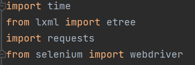
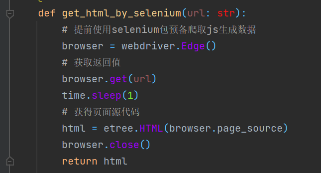
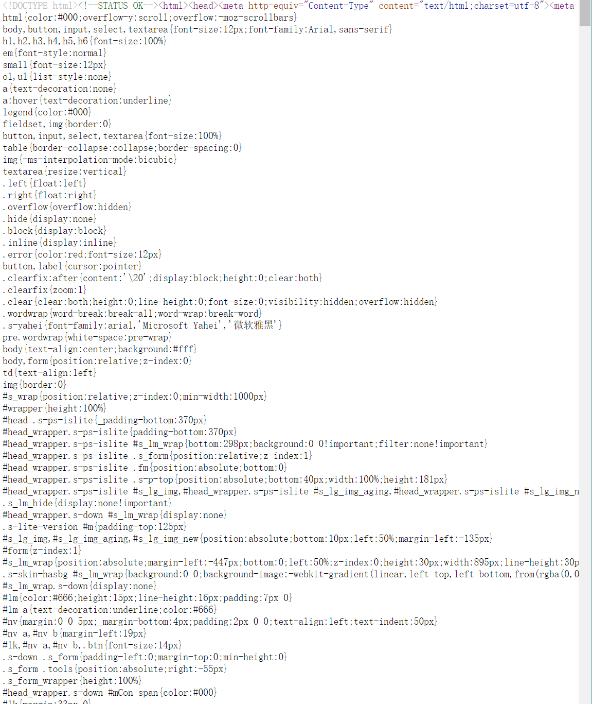
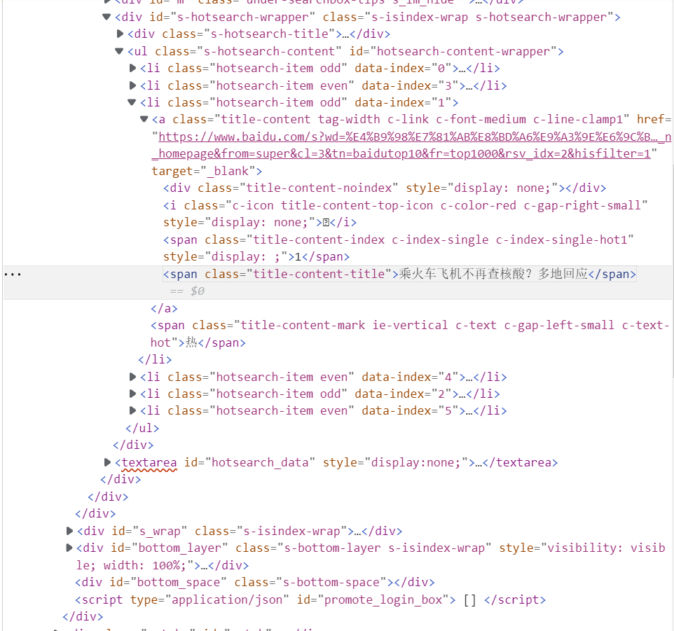
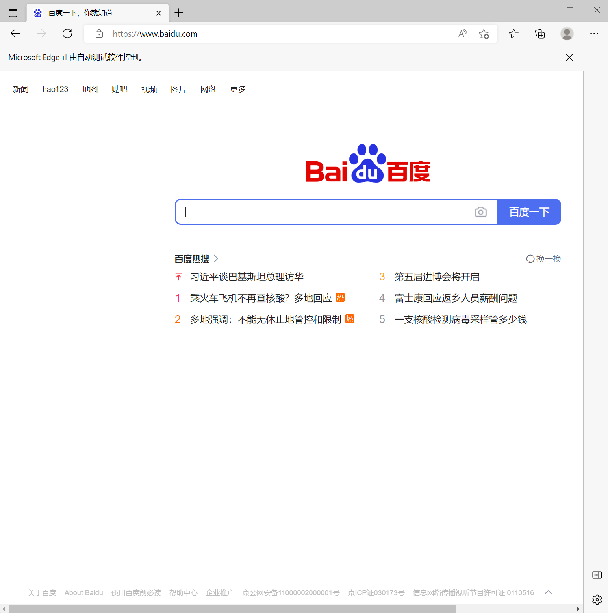
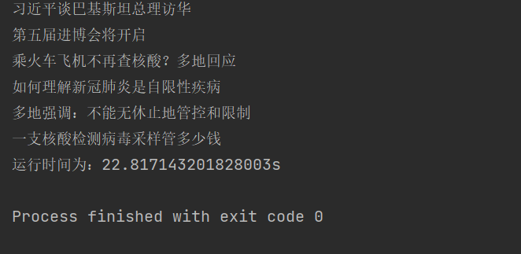

# 提前准备
### 终端运行以下命令
+ pip install lxml
+ pip install requests
+ pip install selenium
---

#### xpath内容随时百度使用，利用F12打开浏览器开发者工具检查元素右键复制xpath获取内容

---

**根据浏览器安装对应驱动进行配置并更改browser**
## 两类函数(by_requests by_selenium)的特点

---
### by_requests

---
**直接获取网页源代码，速度快，但无法获取动态加载的内容**

*例如example.py只能使用selenium，这是因为源代码与网页加载后代码不同*

*源代码元素审查代码此类网页只能采用selenium*

---
### by_selenium

---
**任何网站几乎都可以用selenium解决，但selenium等待网页加载完毕再进一步运行，耗时长**
